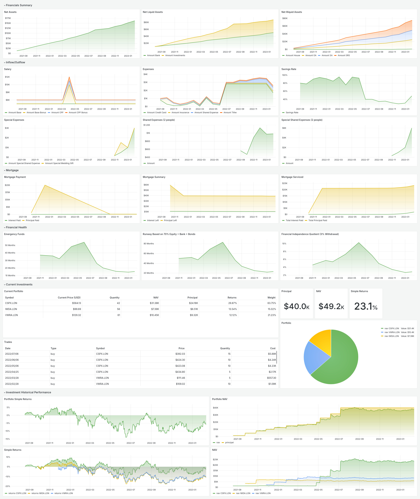
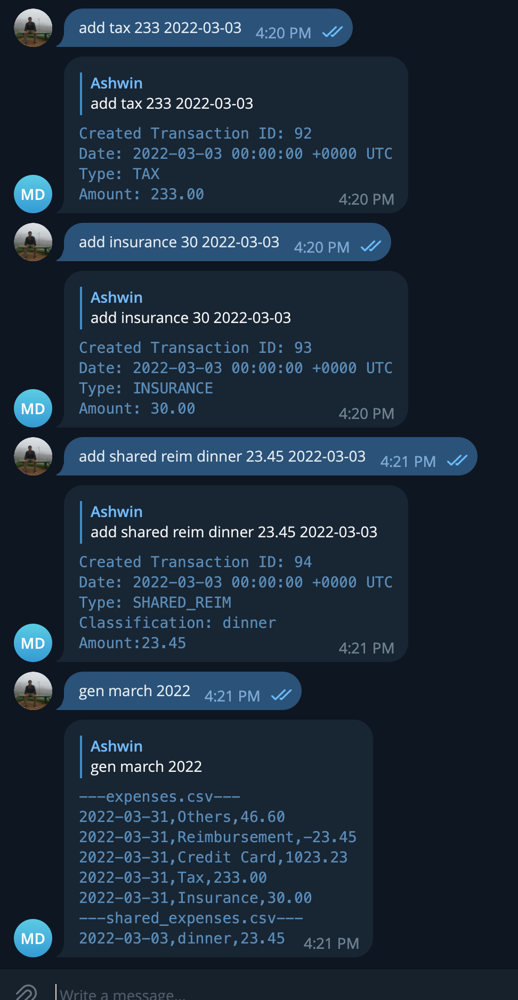

# Moneybags

Moneybags is a way to track your financial independence track in Singapore's context. This is still very much a work in progress, see the 'Feature Roadmap' for more details. We use Grafana as the frontend and it is assumed that Grafana is installed at the moment.

To account for everyday spending, I have been writing into my saved messages and parsing them every month. This is extremely tedious. The aim here is to write a small parser to understand how I spend.





## Feature Roadmap

This list is not exhaustive but a wishlist that I would work on when I'm free. Mostly credit to this [link](https://www.reddit.com/r/singaporefi/comments/p9p668/the_vital_ratios_to_track_on_your_journey_to/).

- [x] Stock Portfolio
- [x] Monthly expenditure
- [x] Income
- [x] Total Net assets
- [x] Automatic detection of investment amount
- [x] Financial Independence Quotient
- [x] Mortgage
- [x] Telegram bot to record expenses
- [x] Other depreciating assets like car
- [x] Tax Calculation
- [ ] Recurring transactions

## Technical Roadmap

- [x] liveness/readiness probes
- [x] MCP server for AI assistants

## MCP API Definition

Moneybags serves the [Model Context Protocol](https://modelcontextprotocol.io) over
streamable HTTP on the same port as everything else, at `/mcp`.

There is **no authentication**, so keep that port on a private network, a VPN or an
SSH tunnel. Anything that can reach it can read your transactions.

Sessions are stateless, so moneybags scales behind more than one replica without
sticky sessions.

### Connecting a client

Point any MCP client at the endpoint:

```json
{
  "mcpServers": {
    "moneybags": {
      "type": "http",
      "url": "http://moneybags:6000/mcp"
    }
  }
}
```

### Tools

#### search_transactions

Searches recorded transactions by their description, optionally restricted to a
single type.

Argument | Required | Explanation
---------|----------|------------
description | no | Matched case-insensitively as a substring, so neither the casing nor the whole note has to match. `coffee` also finds `Starbucks Coffee`. `%` and `_` are matched literally.
type | no | Restrict to a single transaction type. See the types below.
- | no | Leaving both arguments out returns the most recent transactions.

Results come back newest first, capped at 100 transactions. When more matched than
were returned, `truncated` is `true`, so the result is only the most recent slice of
the matches rather than all of them.

Types are matched leniently: casing, `_`, `-` and repeated whitespace are all
normalised, and the Telegram shorthands are accepted. So `shared cc reim`,
`SHARED_CC_REIMBURSE` and `Shared CC Reimburse` are all the same type.

Type | Telegram | Explanation
-----|----------|------------
OWN | own | Regular type of spending for ownself.
REIM | reim | Amount to be reimbursed, usually paying first using CC and friends paying back later.
SHARED | shared | Amount that is shared but other party had paid first.
SHARED REIM | shared reim | Amount to be reimbursed, usually paying first using CC and taking from shared account.
SPECIAL SHARED | special shared | Amount that is shared but other party had paid first and it's a one off thing.
SPECIAL SHARED REIM | special shared reim | Amount to be reimbursed, not counting into regular spend.
SPECIAL OWN | special own | Amount that is spent for myself but special events.
CREDIT CARD | cc | Amount paid using credit card.
SHARED CC REIMBURSE | shared cc reim | Amount used for the shared credit card but for personal use and to be reimbursed
INSURANCE | insurance | Amount spent for insurance.
TITHE | tithe | Amount given to parents.
TAX | tax | Amount paid to the tax man.

An example response:

```json
{
  "transactions": [
    {
      "id": 3,
      "date": "2023-04-05",
      "type": "SHARED_CC_REIMBURSE",
      "description": "COFFEE beans",
      "amount": 12
    }
  ],
  "count": 1,
  "truncated": false
}
```

## Telegram API Definition

### Help

Typing `help` or any unknown command will return the help interface.

### Types

Type | Explanation
-----|------------
reim | Amount to be reimbursed, usually paying first using CC and friends paying back later.
shared reim | Amount to be reimbursed, usually paying first using CC and taking from shared account.
special shared reim | Amount to be reimbursed, usually paying first using CC and taking from shared account, not counting into regular spend.
shared | Amount that is shared but other party had paid first.
special shared | Amount that is shared but other party had paid first and it's a one off thing.
own | Regular type of spending for ownself.
special own | Amount that is spent for myself but special events.
tithe | Amount given to parents.
cc | Amount paid using credit card.
tax | Amount paid to the tax man.
insurance | Amount spent for insurance.
shared cc reim | Amount used for the shared credit card but for personal use and to be reimbursed

### Classification

Classification could be any string field. This is for your own note taking and not used in a special way.

Class | Explanation
------|------------
meal | Amount spent on meals.
housing | Amount spent on housing needs.
whatever you want | whatever description you give it

### Adding a transaction

User: ADD <TYPE> <CLASSIFICATION> <PRICE (no $ sign)> <Optional date (will automatically fix to yyyy-mm-dd), you can even write 'yesterday'>
Service returns: ```
Created Transaction ID: 5
Date: 2023-04-02 14:14:48 +0800 +08
Type: OWN
Classification: hellowyellow
Amount:123.200000
```

### Deleting a transaction

User: DEL <ID>
Service returns: ```
Deleted Transaction ID: 5
Date: 2023-04-02 14:14:48 +0800 +08
Type: OWN
Classification: hellowyellow
Amount:123.200000
```

### Generating a report by month

User: GEN APR 2023
Service returns: 
```
---expenses.csv---
2023-04-30,Others,23.40
2023-04-30,Reimbursement,-46.80
2023-04-30,Insurance,200.54
2023-04-30,Tithe,200.32
2023-04-30,Credit Card,23.40
2023-04-30,Tax,23.40
---shared_expenses.csv---
2023-04-03,table,223.20
2023-04-04,Special:furniture,200.20
```

## Developer Notes

We use protocol buffers to generate some configuration files.

```bash
go install github.com/golang/protobuf/protoc-gen-go@latest
```
